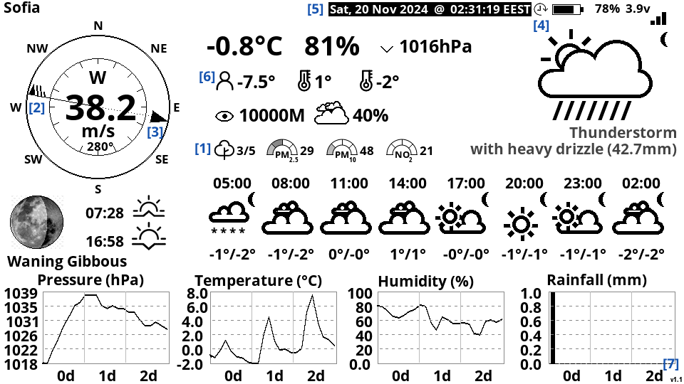

# LilyGo EPD47 OWM weather station (dev-friendly edition)

This is a fork of 'LilyGo EPD47 OWM weather station display' project. It has been updated to work after [OWM's deprecation](https://openweathermap.org/api/one-call-api) of the `One Call API 2.5` originally used by the code.



## Project Summary (for the uninitiated)

This project turns the [Lilygo T5 e-Paper](https://lilygo.cc/en-bg/products/t5-4-7-inch-e-paper-v2-3) into a weather station, displaying data from [OpenWeatherMap](https://openweathermap.org/)'s API. Only a [free-tier API key](https://openweathermap.org/price) is needed.

For a guide on how to configure/build/flash the project (and then forget about it), look at the [Quick Start](#building-quick-start) section.

If you want to experiment with the code and change something yourself, look at the [Hacking](#hacking) section.

## Acknowledgments

Based on code originally developed by [David Bird](https://github.com/markbirss/LilyGo-EPD-4-7-OWM-Weather-Display) and some other forks ([DzikuVx](https://github.com/DzikuVx/LilyGo-EPD-4-7-OWM-Weather-Display), [Xinyuan-LilyGO](https://github.com/Xinyuan-LilyGO/LilyGo-EPD-4-7-OWM-Weather-Display/tree/main), [Xinyuan-LilyGO-S3](https://github.com/Xinyuan-LilyGO/LilyGo-EPD-4-7-OWM-Weather-Display/tree/web)).

## Major changes

* Reworked to use the (still free-tier) `/data/2.5/weather` API, instead of the now-defunct `/data/2.5/onecall` API. No functionality was lost, except for the UV Index.
* Provides a [host emulator](#running-the-on-host-emulator) build that runs (and can be debugged) natively on Linux (or in WSL) and produces a [PNG preview](output.png) of the station's output. That makes it really easy to change something and see the result. Hence, the 'dev-friendly' moniker ;-) .

## Other highlights

* Uses HTTPS for API calls, because, why share your API key with the world, even if it's free-tier?
* [1] Now also displays OWM's [Air Quality Index](https://openweathermap.org/api/air-pollution) and the concentrations and safety-levels of three (user-configurable) air pollutants. Info is provided by another OWM free-tier API.
* [2] Wind speed is now also indicated using [Wind Barbs](https://www.weather.gov/hfo/windbarbinfo).
* [3] The wind finally blows in the correct direction :-P. (At least in the code version I started with, the wind arrow was drawn _towards_ the direction the wind was blowing _from_ and not in the direction it was blowing _to_, which was mildly confusing, at least to me)
* Timezones are now handled with the help of the [AceTime](https://github.com/bxparks/AceTime) library, so no more fiddling with [cryptic TZ strings](https://www.di-mgt.com.au/wclock/help/wclo_tzexplain.html) while configuring the station.
* [4] Now displays a 'DST in effect' indicator.
* Refresh cycle errors (e.g. failed API calls) are now displayed [on-screen](doc_img/err_output.png), so you'll immediately notice if something isn't working.
* [5] "Off duty" mode indicator. To save power, the station only updates between a (user-configurable) on-time and off-time. Now, during "off hours", date/time line is drawn inverted as a reminder that the displayed weather info might be a bit outdated.
* Optimized the sleeping schedule. Previously, even though the station did not update during "off hours", it would still periodically wake up and immediately go back to sleep. Now it sleeps uninterruptedly during "off hours".
* [6] Some UI text elements (Max Temp/Min Temp/Feels like temp) are replaced with icons, to save space.
* [7] Shows code version.

## "Dev-friendly" changes

* Now builds using [PlatformIO](https://platformio.org/), so no more manually hunting for dependencies and toolchains.
* Has a [.devcontainer](https://code.visualstudio.com/docs/devcontainers/containers), so doing dev work in VSCode should work out-of-the-box with no additional set-up.
* Has a systematic, configurable logging output.
* Timings of various refresh operations (fetch weather, draw UI, flush to EPD, etc.) is tracked, to help troubleshoot what's keeping the station awake.
* The source code was split into several files, based on functional areas. The original .ino is gone, sorry (most of it went [here](src/display.cpp) though).
* Added several unit tests for the sleep scheduling code.

## Building quick-start

_This section describes how to get the code running on the Lilygo hardware as quickly as possible. If you are interested in experimenting instead, better explore the [Hacking](#hacking) section._

1. Install [PlatformIO](https://platformio.org/).

    To build the code, only 'PlatformIO Core (CLI)' is needed. Of course, things will also work under the 'PlatformIO IDE'. To install Core, follow [this guide](https://docs.platformio.org/en/latest/core/installation/methods/index.html).

2. Obtain an OpenWeatherMap API key by [signing-up here](https://home.openweathermap.org/users/sign_up).

    Note that we _don't_ need the "One Call API 3.0" that has a separate subscription. A simple free-tier key for the "Professional collections" is sufficient.

3. Clone the repo, if you haven't already done so.

4. Open the configuration file -- [src/config.cpp](src/config.cpp) -- and follow the instructions there: fill in your WiFi creds, OWM API Key, Location, Timezone, etc. _Save you changes._ ;-)

5. Build the project.

    There are at least two [hardware revisions](https://github.com/Xinyuan-LilyGO/LilyGo-EPD47/tree/esp32s3/schematic) of the Lilygo T5 EPD: the original one that has ESP32, and the updated one (v2) that uses ESP32-S3. The PIO build defines two separate 'environments' for them: `epd-release` and `epd-s3-release`.

    To build the project, in a 'PlatformIO Core (CLI)' terminal, in the project's root (the folder containing this README) execute **one** the following commands, depending on the hardware you have:

    ```bash
    pio run -e epd-release
    ```

    or

    ```bash
    pio run -e epd-s3-release
    ```

6. Flashing the firmware

    The procedure is a bit different, depending on the hardware.

    First, ensure the device is connected and seen by the OS.

    6.1. For the original ESP32 T5

    Just run the following commands:

    ```bash
    pio run -e epd-release -t upload
    ```

    You may optionally do `-t upload -t monitor` in the command above, to see the log messages.

    6.2 For the ESP32-S3 Version

    The board must first be put into download mode. Follow the [instructions here](https://github.com/Xinyuan-LilyGO/LilyGo-EPD-4-7-OWM-Weather-Display/tree/web?tab=readme-ov-file) (there's also a YT video).

    Once the board is in flashing mode, run the following command:

    ```bash
    pio run -e epd-s3-release -t upload
    ```

    You may optionally do `-t upload -t monitor` in the command above, to see the log messages.

    _(I don't have the newer ESP32-S3 board, so the instructions for it haven't actually been tested. If they don't work, please, drop me a line)_

## Hacking

_This section provides some assorted tips and tricks, in case you want to do some experiments on your own._

First, make you've followed the configuration steps (setting WiFi creds, OWM API key, GPS coords, etc.) as described in [src/config.cpp](src/config.cpp). You'll get `static_assert()` errors if you don't.

Also, to avoid inadvertently committing secrets to git, consider using the [dev_config.h](src/_dev_config.h) override (see the file for details).

> [!NOTE]
> I've only tested the code on the original, ESP32-based, T5 hardware. It _should_ work with the updated ESP32-S3 revision, as the `LilyGo-EPD47` library is expected to take care of hardware differences between boards. Also, the code has no hard-coded hardware-specific values, e.g. the battery ADC pin is referred to using `BATT_PIN` (a #define coming from the LilyGo-EPD47 lib) instead of the specific num it has on the v1 hardware.
>
> _However, I've never seen this code working on an ESP32-S3 board, and as we all know, with software, if you haven't seen it working, it probably doesn't. I'll really appreciate some feedback from ESP32-S3 board owners._

### Dev environment

The only dev env that's really tested (i.e. what I'm using) is a devcontainer inside a WSL2 Ubuntu on Windows 10, with [Docker CE](https://docs.docker.com/engine/install/) installed inside Ubuntu (and **not** [Docker Desktop](https://www.docker.com/products/docker-desktop/) installed on Windows; yes, it's possible to use CE in WSL). Theoretically, other combinations (e.g. Docker on native Ubuntu; Docker Desktop on Win) should also work, but, again, this has never been tested, so use at your own risk.

The devcontainer has all prerequisites (PlatformIO CLI, some python libs used by various tools, etc) already installed.

Note that, for C++ support, the devcontainer uses [clangd](https://marketplace.visualstudio.com/items?itemName=llvm-vs-code-extensions.vscode-clangd) and [CodeLLDB](https://marketplace.visualstudio.com/items?itemName=vadimcn.vscode-lldb) instead of the somewhat more popular [Microsoft C/C++](https://marketplace.visualstudio.com/items?itemName=ms-vscode.cpptools) add-on. That's mostly due to a personal preference. The PIO build produces `compile_commands.json` that can be used with either add-on.

Also note that the devcontainer has no [PlatformIO IDE](https://marketplace.visualstudio.com/items?itemName=platformio.platformio-ide) preinstalled, as the advanced functionality it provides isn't really needed.

### Code completion

For code completion, browsing and other features, the clangd extension relies on a compilation database, a file containing the exact command line options each file was compiled with. The file is called `compile_commands.json` and the project is configured to produce it in the root directory. This doesn't happen automatically during regular build though.

Instead, to generate the compilation database the following command needs to be executed, every time the source code structure changes (or for a freshly cloned project).

```bash
pio run -e epd -t compiledb
```

The environment (the value after `-e`) depends on what you currently doing (see next section). If you are working on the device-specific code, use `-e epd` or `-e epd-s3`. If you are working with the on-host emulator, use `-e host`.

Typically, to ensure correct results after a new compilation database has been generated, one needs to restart clangd by executing `clangd: Restart language server` from VSCode's command palette.

### Build environments

PlatformIO has the notion of 'environment', i.e. a specific way/target to compile the sources. This project defines the following environments:

* **epd** - debug build for the ESP32-based v1 hardware.
* **epd-release** - release build for the ESP32-based v1 hardware.
* **epd-s3** - debug build for the ESP32-S3-based v2 hardware.
* **epd-s3-release** - release build for the ESP32-S3-based v2 hardware.
* **host** - build of the on-host/linux emulator (see below).

### Flashing firmware from the devcontainer on WSL2

In that configuration, USB devices attached to the Windows OS are not immediately shared with the WSL2 OS. So, to flash the device from within the WSL devcontainer, the USB device must first be forwarded to the WSL Ubuntu and then to the container itself.

To achieve that:

1. Install [usbipd](https://github.com/dorssel/usbipd-win) to share the USB device with the WSL.

    With usbipd installed, share the device like the following:

    ```bash
    usbipd wsl attach --busid 2-3
    ```

    Your `busid` might be different: use `usbipd wsl list` to get the correct value.

2. Edit the [.devcontainer/devcontainer.json](.devcontainer/devcontainer.json) file.

    Specifically, uncomment the `--device=/dev/ttyACM0` "runArgs" values.

3. From VSCode's palette, choose 'Dev containers: Rebuild Container'

Once this is done, it will be possible to flash the device by simply executing `pio run -e epd -t upload` from VSCode's terminal. Remember to change the PIO environment (`-e epd`) as needed.

**Please note** that with `--device=/dev/ttyACM0` uncommented, the devcontainer will fail to start if the USB device is not visible to the WSL OS. In that case, VSCode will offer you to edit the .devcontainer file. Simply comment "runArgs" again, and rebuild/reopen the devcontainer.

### Running the on-host emulator

Perhaps the biggest quality-of-life improvement for developers in this version is the ability to build/run/debug the project on a linux host and see a preview of the UI the station will produce. This on-host emulator can be run either against [static test data](src/host/test_data.cpp) or against live data fetched from OWM's API. In the source code, when different behavior is needed between the esp32 and the emulator build, it's guarded by `#ifdef HOST_BUILD`.

The entry point of the on-hose emulator is here: [src/host/main.cpp](src/host/main.cpp).

To build the on-host emulator, run the following command:

```bash
pio run -e host
```

There's also predefined VSCode task called 'Build Host emulator' to do that. It's also the "default build task", so one can simply press Ctrl+Shift+B.

To run/debug the on-host emulator, use the provided VSCode [launch configuration](.vscode/launch.json). Alternatively, just run the compiled binary:

```bash
.pio/build/host/program 
```

Both ways will produce a file called `output.png` in the current directory.

### Source code organization

The source code shared between the real hardware build and the on-host emulator build resides directly under [src](src/) folder.

Host emulator specific code is under [src/host/](src/host/). ESP32 specific code is under [src/esp32/](src/esp32/).

The [scripts/](scripts/) folder has several tools used for converting images and fonts into a format usable by the EPD drawing code.

Most folders provide a folder-level README with additional detail ([here](assets/README.md), [here](boards/README.md) and [here](scripts/README.MD)).

### Unit tests

There are a handful of unit tests, mostly related to the sleep scheduling code. They are only meant to be executed on the linux host. To run them

```bash
pio test -e host
```

## Licensing

GPLv3 (or later), the same license as the fork's source fork.
